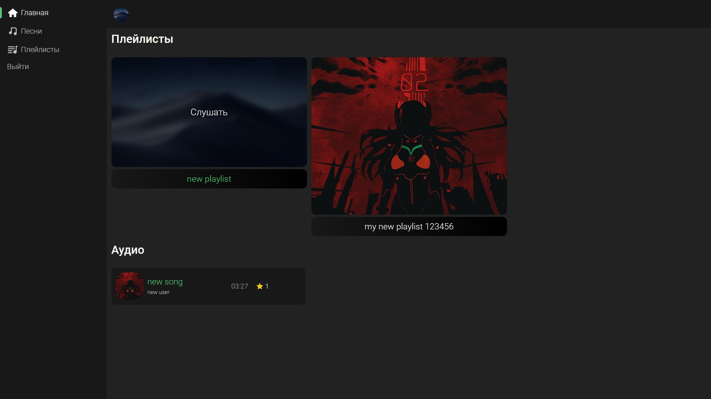
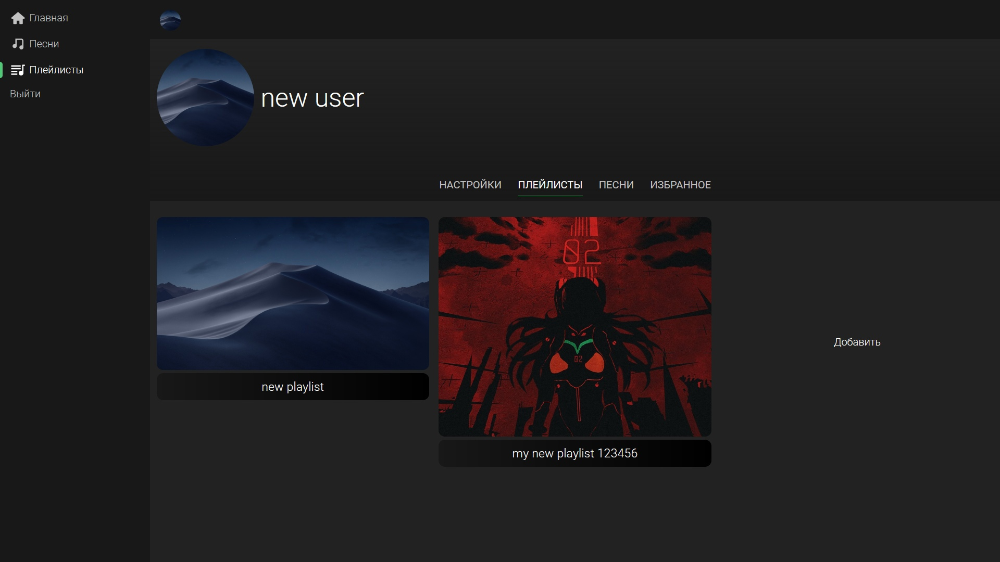
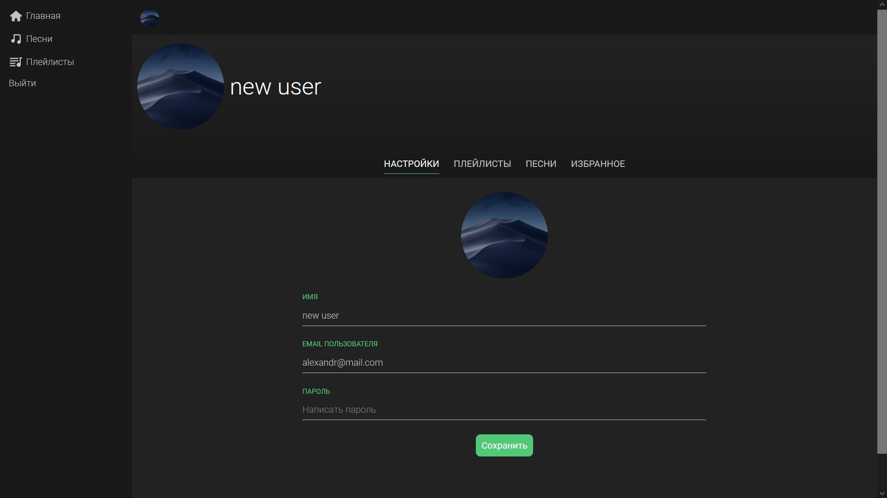

# Music Application PEVN

## Description

This project was created in order to listen not only to your own music, but also to the music of other users. PEVN stack is used here

## Options

### Registration and Login Pages


### Home page



### Listening to playlists


### User favorite audio page


### User audio page


### User playlist page



### User settings page



## Build Setup

```bash
# install dependencies
$ npm install

# serve with hot reload at localhost:3000
$ npm run dev

# build for production and launch server
$ npm run build
$ npm run start

# generate static project
$ npm run generate
```